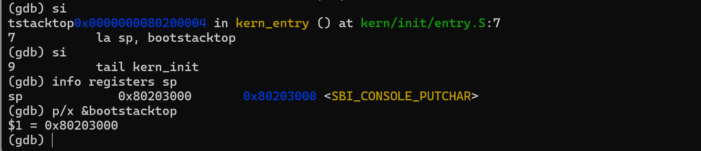
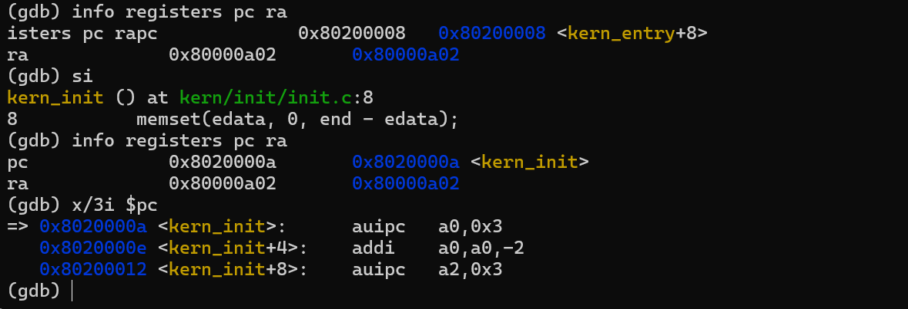
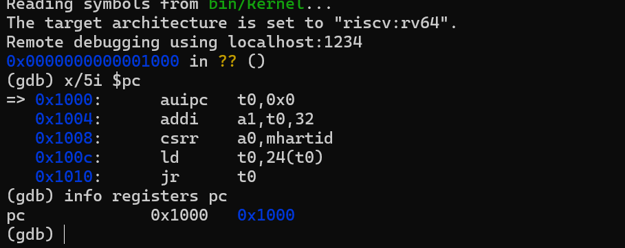
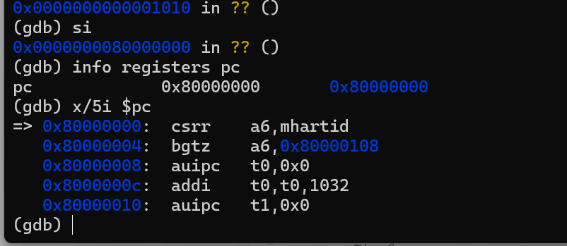
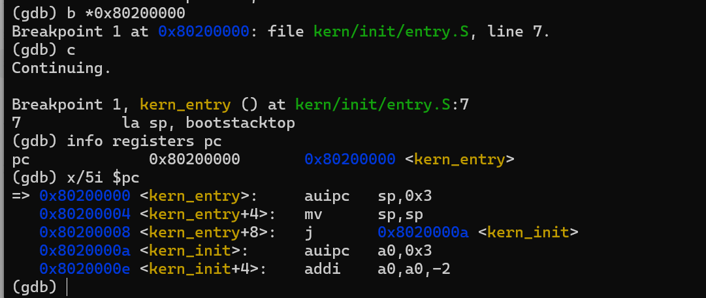
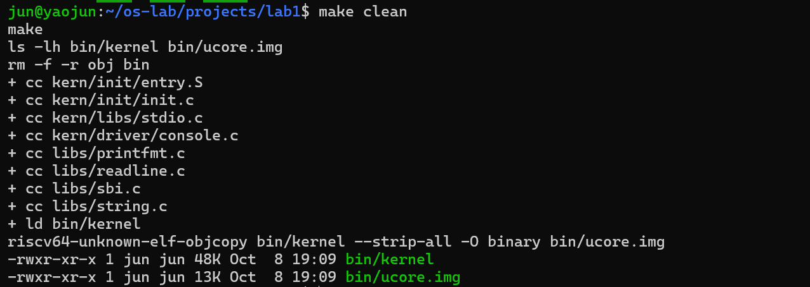
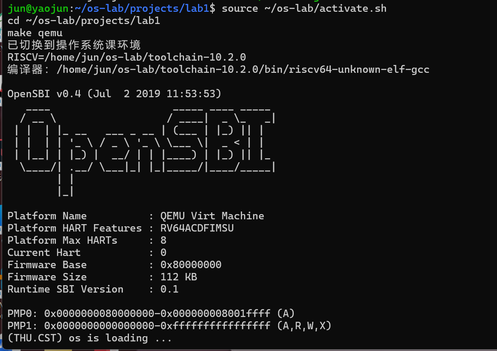

# 操作系统实验报告

## 实验基本信息

| 项目 | 内容 |
|---|---|
| 实验名称 | Lab1：比麻雀更小的麻雀（最小可执行内核） |
| 小组成员 | 2412932-李潇健、2410718-姚钧、2410764-朱彦泽 |
| 完成日期 | 2026-10-07 |

### 小组分工

练习、报告内容与答辩采用同一主题划分；各主题以源码分析和实验记录为依据，不按终端操作人拆分实验结果。

| 成员 | 负责的练习或模块 | 报告内容与答辩主题 |
|---|---|---|
| 2412932-李潇健 | 链接布局、入口汇编、练习 1 | 内核地址与栈的分析，练习 1 解答 |
| 2410718-姚钧 | 构建镜像、复位指令、练习 2 | 构建与启动主线，GDB 跟踪和练习 2 解答 |
| 2410764-朱彦泽 | SBI、控制台与格式化输出 | 输出链的模块分析，OS 原理对应与总结 |

---

## 一、实验目的

本实验围绕最小可执行内核和启动流程，目标包括：

1. 理解链接脚本如何规定内核的内存布局、入口符号和 `0x80200000` 加载地址。
2. 使用 RISC-V 交叉编译工具链生成 ELF 内核，再用 `objcopy` 得到裸二进制镜像。
3. 理解 QEMU、复位代码、OpenSBI 和内核之间的启动交接关系。
4. 理解内核入口如何建立栈并转入 C 函数，以及如何通过 SBI 的 `ecall` 服务完成格式化输出。
5. 掌握 QEMU 远程调试接口和 GDB 的断点、单指令执行、寄存器与内存检查方法，用实际观察验证启动流程。

给定内核在输出信息后进入死循环。本实验围绕现有代码分析与调试，没有新增内核功能。

---

## 二、实验环境

本地复现使用 Windows、WSL Ubuntu 24.04、RISC-V GCC 13.2.0、GNU binutils 2.42、QEMU 4.1.1、`gdb-multiarch` 15.1 和 GNU Make 4.3。内核通过交叉编译生成；QEMU 使用 Makefile 的 `-device loader` 参数装载镜像，GDB 连接 1234 端口。所附构建与运行图像来自另一套激活了 `toolchain-10.2.0` 的终端环境，图像本身未显示 QEMU 版本。

| 成员 | AI 编程工具 | 底层模型 | 用途 |
|---|---|---|---|
| 2412932-李潇健 | DeepSeek，使用界面未记录 | DeepSeek，版本未记录 | 实验分析辅助 |
| 2410718-姚钧 | DeepSeek，使用界面未记录 | DeepSeek，版本未记录 | 实验分析辅助 |
| 2410764-朱彦泽 | DeepSeek，使用界面未记录 | DeepSeek，版本未记录 | 实验分析辅助 |

现有协作对话未用于生成或修改内核源码。已保存的提问材料见 [prompt.md](./prompt.md)。

---

## 三、实验整体逻辑分析

### 3.1 本章节的逻辑主线

实验按“构建内核 → 装载镜像 → 固件交权 → 建立内核栈 → 输出信息 → GDB 验证”的顺序展开：

```text
C/汇编源码
  ↓ RISC-V 交叉编译、链接脚本
bin/kernel（ELF：入口、段、符号、调试信息）
  ↓ objcopy -O binary
bin/ucore.img（裸二进制）
  ↓ QEMU loader 在 CPU 开始前放入 0x80200000
PC=0x1000 的复位代码 → PC=0x80000000 的 OpenSBI
  ↓ OpenSBI 初始化并把控制权交给 S 模式内核
PC=0x80200000 的 kern_entry
  ↓ 建立内核栈、尾调用 kern_init
cprintf → 格式化输出 → cons_putc → SBI ecall → QEMU 终端
  ↓
while (1)
```

ELF 入口、镜像装载地址和固件交权地址都需与 `0x80200000` 对应。入口汇编建立栈后，C 代码才能通过 SBI 服务输出启动信息；GDB 用于观察这些阶段的控制流和寄存器状态。

### 3.2 功能的逐步实现

链接脚本先确定入口和各段地址，交叉编译与 `objcopy` 再生成 ELF 和裸镜像。镜像具备正确的地址布局之后，QEMU 才能预装载它；复位代码和 OpenSBI 随后将 CPU 控制权交给内核。入口汇编设好栈，`kern_init` 才能调用格式化输出函数。这个顺序也决定了调试时应依次检查镜像、复位 PC、固件入口和内核入口。

本工程的 Makefile 使用以下装载参数：

```text
-device loader,file=bin/ucore.img,addr=0x80200000
```

QEMU 在虚拟 CPU 执行前将 `bin/ucore.img` 放入 `0x80200000`。本机连接 GDB 时 PC 仍在 `0x1000`，但入口地址已有与镜像开头相同的机器码。因而本工程由 **QEMU 预装载镜像**，OpenSBI 完成固件初始化并将控制权交给内核；与 bootloader 从存储设备读取镜像的启动方式不同。

---

## 四、实验内容与实现

### 练习 1：理解内核启动中的程序入口操作

本练习分析 `kern/init/entry.S` 中两条入口指令的作用及其在启动过程中的目的。

#### `la sp, bootstacktop`

`la` 是加载地址的伪指令。它把链接符号 `bootstacktop` 的地址写入栈指针寄存器 `sp`。`entry.S` 先在 `.data` 中按页对齐定义 `bootstack`，再用 `.space KSTACKSIZE` 预留栈空间；`bootstacktop` 位于这块空间的高地址端。栈按 RISC-V 约定由高地址向低地址增长，所以空栈的初始 `sp` 应设置为 `bootstacktop`。

本次构建的符号值为：

```text
bootstack    = 0x80201000
bootstacktop = 0x80203000
KSTACKSIZE   = 0x2000 = 8192 bytes
```

GDB 在 `kern_entry` 第一条指令执行前观察到 `sp=0x8001bd80`；执行 `la` 展开的两条机器指令后，`sp=0x80203000`，与 `&bootstacktop` 相等。内核由此获得独立的 8 KiB 栈，供后续 C 函数调用和局部变量使用。

本次反汇编中，`la` 展开为：

```asm
0x80200000 <kern_entry>:   auipc sp,0x3
0x80200004 <kern_entry+4>: mv    sp,sp
```

`auipc` 已计算出 `0x80203000`，因此链接后的第二条指令显示为 `mv sp,sp`。伪指令的具体展开可随链接结果改变，其语义仍是将 `bootstacktop` 地址写入 `sp`。



图 1. 执行入口的栈初始化指令后，`sp` 与 `&bootstacktop` 均为 `0x80203000`。GDB 同时显示该地址的另一符号名，数值比较仍确认栈顶位置。

#### `tail kern_init`

`tail` 是尾调用伪指令。它无条件跳转到 `kern_init`，不写入返回地址寄存器 `ra`。本次反汇编为：

```asm
0x80200008 <kern_entry+8>: j 0x8020000a <kern_init>
```

单步执行后，PC 从 `0x80200008` 到 `0x8020000a`，`ra` 保持 `0x80000a02`。`tail` 不建立新的返回路径；`kern_init` 声明为 `noreturn`，最终进入 `while (1)`，因而无须返回入口汇编。



图 2. 执行 `tail kern_init` 后，PC 从 `0x80200008` 到 `0x8020000a`，`ra` 保持 `0x80000a02`。

`la sp, bootstacktop` 为 C 内核建立栈；`tail kern_init` 不改写返回地址，直接把控制权交给 C 入口。这两条指令完成了从固件执行环境到最小内核执行环境的交接。

### 练习 2：使用 GDB 验证启动流程

本练习从复位地址跟踪至内核入口，记录最初几条指令的地址、寄存器变化和作用。本机使用 QEMU 4.1.1。

#### 调试过程

1. 在终端 A 使用 QEMU 4.1.1 执行 Makefile 的 `make debug` 目标。其中 `-S` 使虚拟 CPU 在第一条指令前暂停，`-s` 开放 GDB 端口 1234。
2. 在终端 B 运行 `gdb-multiarch bin/kernel`，设置 `riscv:rv64` 架构并连接 `localhost:1234`；这与指导书中的 `make gdb` 完成相同的连接和符号加载。
3. 初始 `pc=0x1000`。使用 `x/5i $pc`、`si` 和 `info registers` 逐条观察复位代码。
4. CPU 执行跳转后到达 `0x80000000` 的 OpenSBI。设置 `break *0x80200000` 并继续，最终命中 `kern_entry`。
5. 在 `kern_entry` 单步检查 `sp`、PC 和 `ra`，对应练习 1 的入口指令。



图 3. GDB 连接后 PC 为 `0x1000`；`x/5i $pc` 显示复位代码的五条指令。



图 4. 执行 `0x1010` 的跳转指令后，PC 到达 `0x80000000`，开始执行 OpenSBI 固件代码。



图 5. `b *0x80200000` 命中 `kern_entry`，表明固件阶段已将 CPU 控制权转交到内核入口。

#### 上电后最初几条指令及功能

QEMU 4.1.1 的首批有效指令位于 MROM 的 `0x1000` 至 `0x1010`：

| 地址 | 指令 | 实测寄存器变化 | 主要功能 |
|---|---|---|---|
| `0x1000` | `auipc t0,0x0` | `t0=0x1000` | 取得复位代码的 PC 相对基址 |
| `0x1004` | `addi a1,t0,32` | `a1=0x1020` | 把设备树 DTB 地址作为第二个启动参数 |
| `0x1008` | `csrr a0,mhartid` | `a0=0` | 读取当前硬件线程 Hart ID，作为第一个启动参数 |
| `0x100c` | `ld t0,24(t0)` | `t0=0x80000000` | 从复位向量常量区取出 OpenSBI 入口地址 |
| `0x1010` | `jr t0` | `pc=0x80000000` | 跳转到 OpenSBI，开始固件初始化 |

复位代码位于 `0x1000` 至 `0x1010`，负责准备 Hart ID、设备树地址及固件入口，然后跳转到 `0x80000000`；它本身不读取内核文件，也不完成全部硬件初始化。OpenSBI 运行后将控制权交给 `0x80200000` 的内核入口。

在 PC 为 `0x1000` 时，`0x80200000` 已有与镜像开头相同的机器码；此后设置写监视点，至入口断点命中前未观察到该地址再次被写入。这与 Makefile 的 QEMU 预装载参数一致。写监视点只监视指定地址的运行期写入，不能捕获 GDB 连接前发生的预装载。

GDB 观察到的控制流为 `0x1000（MROM）→ 0x80000000（OpenSBI）→ 0x80200000（kern_entry）→ 0x8020000a（kern_init）`，对应启动参数准备、固件初始化、内核栈建立和 C 入口执行。

### 功能模块：最小内核的启动与输出

最小内核的关键模块及调用关系如下：

| 模块/文件 | 核心作用 | 与其他模块的关系 |
|---|---|---|
| `tools/kernel.ld` | 指定 RISC-V 架构、`kern_entry` 入口、`0x80200000` 基址和各 section 布局 | 链接结果必须和 QEMU 装载地址、入口汇编一致 |
| `kern/init/entry.S` | 定义 `kern_entry`，预留内核栈，初始化 `sp`，尾调用 `kern_init` | 承接 OpenSBI，建立 C 代码运行所需的最小环境 |
| `kern/init/init.c` | 清理 `edata` 到 `end`，调用 `cprintf`，然后死循环 | 是最小内核的 C 入口和可见启动标志 |
| `libs/sbi.c` | 按 SBI legacy 调用约定把服务号放入 `a7/x17`、参数放入 `a0` 至 `a2`，执行 `ecall` | 将 S 模式内核请求转交 M 模式 OpenSBI |
| `kern/driver/console.c` | 用 `cons_putc` 封装 SBI 单字符输出 | 连接高层格式化输出和底层 SBI |
| `kern/libs/stdio.c`、`libs/printfmt.c` | 完成 `cprintf`、格式解析和逐字符回调 | 不依赖宿主机 glibc，为内核提供自己的格式化输出 |
| `Makefile`、`tools/function.mk` | 组织编译、链接、`objcopy`、QEMU 启动和 GDB 入口 | 把源码转换为可运行、可调试的实验对象 |

输出沿 `cprintf → vcprintf → vprintfmt → cputch → cons_putc → sbi_console_putchar → sbi_call` 传递。`vprintfmt` 负责格式解析，`cons_putc` 将字符交给 SBI 封装；`sbi_call` 把服务号置于 `a7`、字符参数置于 `a0`，通过 `ecall` 请求 OpenSBI 输出。这样，最小内核不依赖宿主机的 `printf` 实现。

本次链接结果中 `edata=end=0x80203008`，故 `memset(edata,0,end-edata)` 的长度为 0；源码提供了 BSS 清零步骤，但当前构建没有非空 BSS 可供观察。`bin/kernel` 保存 ELF 结构与调试信息，`bin/ucore.img` 是按地址布局导出的裸字节镜像。链接脚本的 `ALIGN(0x1000)` 将数据段对齐到 4096 字节边界。

---

## 五、测试与验证

### 5.1 构建与启动结果

执行 `make` 生成 `bin/kernel` 和 `bin/ucore.img`。`readelf` 显示 ELF64 RISC-V 内核的入口为 `0x80200000`，与链接脚本和 QEMU 装载地址一致；ELF 保留调试符号，裸镜像用于按地址装载。在 QEMU 4.1.1 下执行 `make qemu`，终端先显示 OpenSBI v0.4，再输出 `(THU.CST) os is loading ...`；随后程序保持运行，与 `kern_init` 的死循环一致。图 7 展示了另一终端环境中相同的启动输出。

### 5.2 构建与运行输出



图 6. 执行 `make clean`、`make` 后生成 `bin/kernel` 和 `bin/ucore.img`。



图 7. `make qemu` 启动后显示 OpenSBI v0.4 和内核输出 `(THU.CST) os is loading ...`。

### 5.3 调试验证

图 3 至图 5 对应复位、固件入口和内核入口，图 1 与图 2 对应入口汇编对 `sp`、PC 与 `ra` 的影响。断点和单步观察与第 4 节的指令分析一致；构建成功或镜像已装入内存，均不能单独代替“CPU 已执行内核”的验证。

---

## 六、实验总结与收获

### 对操作系统的理解

| 实验中的具体机制 | 对应的 OS 原理 | 联系与差异 |
|---|---|---|
| `0x1000` 复位代码、`0x80000000` OpenSBI、`0x80200000` 内核 | 启动链与控制权交接 | CPU 先执行固件再进入内核；本工程的镜像由 QEMU 预装载，OpenSBI 负责初始化和交权，并未从硬盘读取内核。 |
| 链接脚本、ELF 入口与 `0x80200000` 装载地址 | 程序内存布局 | 链接阶段确定内核代码和数据的地址，装载地址必须与之匹配；本实验直接使用物理地址，尚无进程虚拟地址空间或页表映射。 |
| `la sp, bootstacktop` 与 `tail kern_init` | 函数调用约定与栈 | C 函数依赖有效的栈指针；内核入口没有现成的 C 运行时，须先设栈，且跳往不返回的 `kern_init` 时无须改写 `ra`。 |
| 内核经 `ecall` 调用 OpenSBI 控制台服务 | 特权级与受控服务接口 | 本实验由 S 模式请求 M 模式固件服务；普通用户程序的系统调用则由 U 模式请求 S 模式内核服务，方向和服务提供者不同。 |

本实验尚未实现内核的中断与异常处理、物理内存分配及页表、进程与调度、同步、文件系统和用户态系统调用。`kern_init` 只输出信息后循环，上述能力不属于本次最小内核。

### AI 协作开发的经验

DeepSeek 可辅助梳理启动地址、模块关系和待核对的问题，但实验结论须落到 Makefile、链接脚本或 GDB 观察上。本实验需要特别区分两个动作：QEMU loader 将镜像放入内存，OpenSBI 随后把 CPU 控制权交给内核。`sp` 和 `ra` 的变化也只能通过入口指令和调试结果解释，不能仅凭最终的终端输出推断。

---

## 参考资料

1. 《2026Fall riscv64-ucore 操作系统实验指导书》，第 53 至 90 页。
2. 2026 年 9 月 22 日操作系统实验课文字记录。
