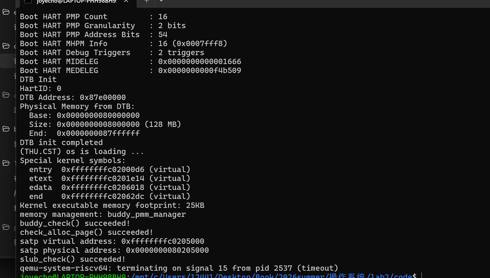

# 操作系统实验报告

> 当前状态：物理页初始化、Best-Fit、Buddy System 和简化版 SLUB 对象分配器已完成；`make grade` 的 Page Init 与 Best-Fit 两项均为 OK，总分 20/20。Buddy 和 SLUB 有独立的内核自检，评分脚本不评分这两项。以下执行记录来自本工作环境，不表示三名组员分别在各自电脑上完成了相同操作。

## 实验基本信息

| 项目 | 内容 |
| --- | --- |
| 实验名称 | Lab2：物理内存与页表；连续页分配算法 |
| 小组成员 | 2412932-李潇健、2410718-姚钧、2410764-朱彦泽（沿用 Lab1 报告中的小组信息，提交前由成员核对） |
| 源码目录 | 本分支根目录的 `code/` |
| 报告目录 | 本分支根目录的 `report/` |
| 本稿修订日期 | 2026-10-23 |
| 最终完成日期 | 三名成员核对分工、个人操作记录和课程提交要求后填写 |
| 验证结果 | `make grade`：Page Init OK、Best-Fit OK，20/20 |

### 小组分工与证据范围

下表参照 Lab1 报告的答辩分工写法，沿用[Lab2 任务分工](../任务分工.md)中的模块安排，并给出提交前各人要核对的材料。它是工作与讲解任务的分配；当前截图和本机验证不能证明三人分别编写或运行过代码。个人实现、操作及 AI 使用情况须由成员本人确认。

| 成员 | 模块与答辩主责 | 提交前个人核对任务 | 共同必会 |
| --- | --- | --- | --- |
| 2412932-李潇健 | 物理页初始化（功能模块一） | 逐行核对 `page_init()` 与图 2；解释设备树范围、`pages` 位置、保留页和空闲页边界；核对评分测试对初始化的实际检查项 | 启动到 `pmm_init()` 的流程、内核自检与两项评分结果 |
| 2410718-姚钧 | Best-Fit 管理器（分配任务二） | 核对图 3—5 与 `best_fit_pmm.c`；讲清选块、拆分、按地址插入和前后合并；确认原有 `basic_check()`、`best_fit_check()` 未被改动 | 管理器六个回调、内核自检与两项评分结果 |
| 2410764-朱彦泽 | 管理器集成、启动适配与验证；本报告“启动兼容调整”和第五章 | 核对管理器选择行、图 6—11、`Makefile` 与 `grade.sh`；从最终源码复核构建、QEMU 自检、`make grade` 及失败修复记录；检查图片和提交材料 | 页初始化与 Best-Fit 原理、内核自检与两项评分结果 |

三人分别准备上述讲解，并共同检查报告结论与源码、截图是否一致。若实际代码编写或终端操作的人员与此分工不同，应如实更新记录，不能仅凭主责表推定个人贡献。

---

## 一、实验目的

1. 理解物理内存如何以固定大小的页为单位管理，以及页描述符与实际物理页的对应关系。
2. 从设备树读取可用物理内存范围，建立页描述符数组，保护内核及管理元数据占用的物理页。
3. 实现 Best-Fit 连续页分配：在所有足够大的空闲块中选择最小者，并维护分配、释放和合并后的空闲页计数。
4. 理解内核启动映射、管理器接口和自检之间的依赖，用编译、QEMU 输出和评分脚本验证实现。

本实验处理内核启动阶段的**物理页分配**。当前代码尚未实现进程地址空间、缺页处理或通用用户态内存分配，不能将这些功能写作本次成果。

---

## 二、实验环境

### 2.1 本机已验证环境

| 项目 | 实测值 | 用途 |
| --- | --- | --- |
| 宿主与执行环境 | Windows 上的 WSL Ubuntu | 在 Linux 终端中构建和运行实验 |
| 交叉编译器 | `riscv64-unknown-elf-gcc` 14.2.0 | 编译 RISC-V 内核 |
| QEMU | `qemu-system-riscv64` 10.2.1 | 运行 `virt` 机器及 OpenSBI |
| GNU Make | 4.4.1 | 构建内核、启动 QEMU、运行评分 |
| 其他工具 | Python 3、tar、timeout；RISC-V ld、objcopy、objdump | 注入评分测试、处理镜像和限时验证 |

本分支将 Lab2 源码放在根目录的 `code/`，命令在 WSL 中执行；报告截图拍摄于整理前的工作区路径 `lab2/code/`。当前 Makefile 生成 `bin/kernel`（ELF）和 `bin/ucore.img`（裸镜像）；QEMU 使用 `-kernel bin/ucore.img` 交给 OpenSBI 启动。


图 1：WSL 中的 `lab2/code` 路径，以及交叉编译器、QEMU 和 GNU Make 的版本输出。

### 2.2 AI 辅助与操作记录

当前工作会话使用 Codex 辅助阅读源码、实现代码、分析 QEMU 兼容问题并整理报告。可核对的用户提问原文及工作链见 [`prompt.md`](./prompt.md)。该文件顶部新增的任务一至三提示词是**事后拟写、尚未实际发送的示例**，不能作为当时使用过的提示词或 AI 回复记录；如需提交实际对话，应从使用账号导出原始记录。具体模型名称和各成员本人是否使用 AI，须由实际使用者核对。本报告所附图片是用户保存到 `report/images/` 的源码和终端截图；它们证明图中所示操作与输出，不表示三名组员分别完成了相同操作。

---

## 三、实验整体逻辑分析

### 3.1 从启动到内存管理

```text
交叉编译 + 链接脚本 → bin/kernel → objcopy → bin/ucore.img
    ↓ QEMU -kernel，OpenSBI 将控制权交给内核
kern_entry：保存启动参数 → 启用 Sv39 启动页表 → 设置高地址内核栈 → 进入 kern_init
    ↓
dtb_init：从设备树取得 RAM 起点和大小
    ↓
pmm_init：选择 Best-Fit 管理器 → page_init 建立页描述符与空闲区
    ↓
check_alloc_page：执行 best_fit_check 的断言自检
    ↓
内核打印成功信息，随后进入常驻循环
```

启动页表同时映射 `0x80000000` 起的低地址窗口和对应的内核高地址窗口。写入 `satp` 后，PC 尚在低地址，必须能继续取指；跳转到高地址后，内核再通过高地址映射访问同一物理内存。该映射窗口的大小为 1 GiB；设备树在本次 QEMU 启动中实际报告的 RAM 为 128 MB，二者不能混为一谈。

### 3.2 页描述符与分配器接口

`struct Page` 记录一个物理页的引用计数、状态标记、空闲块长度和链表节点。`pages[i]` 对应从 `DRAM_BASE` 起第 `i` 个物理页；`page2pa()` 与 `pa2page()` 在页描述符和物理地址之间转换。`PG_reserved` 表示页不可分配，`PG_property` 仅标记空闲连续块的首个页，其 `property` 保存该块页数。

`pmm.c` 通过 `struct pmm_manager` 的六个回调使用分配器：`init`、`init_memmap`、`alloc_pages`、`free_pages`、`nr_free_pages` 和 `check`。当前 `init_pmm_manager()` 选择 `best_fit_pmm_manager`；因此上层的 `alloc_pages()`、`free_pages()` 调用会转交给 Best-Fit 实现。

---

## 四、实验内容与实现

### 指导书练习的规格与提示词状态

| 练习 | 本报告采用的规格（spec） | 提示词与实际状态 |
| --- | --- | --- |
| 分配任务一：First-Fit 思考题 | 解释四个核心函数、块首元数据、分配与合并，并分析改进空间 | [`prompt.md` 任务一](./prompt.md#任务一first-fit-阅读提示词)为事后拟写；本报告给出源码分析。 |
| 分配任务二：Best-Fit | 符合 `pmm_manager` 接口、选最小可用块、拆分、地址有序释放与双向合并，保留原检查函数 | [`prompt.md` 任务二](./prompt.md#任务二best-fit-实现提示词)为事后拟写；当前代码和本地评分已验证。 |
| 分配任务三：Buddy System | 生成独立管理器和测试，按二次幂拆分与真正伙伴合并，能编译运行 | [`prompt.md` 任务三 A/B](./prompt.md#任务三buddy-system-实现与测试提示词)为整理后的示例；`buddy_pmm.c` 已实现并通过独立 QEMU 自检。 |
| 扩展 Challenge：SLUB | 基于页分配实现任意正大小对象申请与释放，并编写测试 | 下文和 [`prompt.md` 扩展任务 A/B](./prompt.md#扩展任务-challengeslub-实现与测试提示词)为整理后的示例；`slub.c` 已实现，在 Best-Fit 和 Buddy 两种页分配器下通过 QEMU 自检。 |

此表把**拟写的 prompt**与**实际实现证据**分开；不能把事后设计稿写成当时发送给 AI 的原始消息。

### 功能模块一任务一：物理页初始化

**分工负责人：** 2412932-李潇健（负责核对本节并准备讲解；实际实现经历由本人确认）。

**对应源码：**[`code/kern/mm/pmm.c`](../code/kern/mm/pmm.c)、[`code/kern/driver/dtb.c`](../code/kern/driver/dtb.c)。

`dtb_init()` 解析设备树的内存节点，`page_init()` 通过 `get_memory_base()`、`get_memory_size()` 取得物理内存边界。本次启动输出为 `Base=0x80000000`、`Size=0x08000000`（128 MB），所以结束地址的下一字节是 `0x88000000`；`npage=PPN(0x88000000)=0x88000`。地址映射偏移量设为 `PHYSICAL_MEMORY_OFFSET`，供 `PADDR()` 等转换使用。

页描述符数组 `pages` 放在内核链接符号 `end` 之后，地址按 4 KiB 向上对齐：

```text
pages = ROUNDUP(end, PGSIZE)
page_count = npage - nbase
free_start = max(ROUNDUP(PADDR(pages + page_count), PGSIZE),
                 ROUNDUP(mem_base, PGSIZE))
free_end = ROUNDDOWN(mem_base + mem_size, PGSIZE)
```

先把 `page_count` 个页描述符全部标记为 `PG_reserved`，再将 `[free_start, free_end)` 对应的完整页交给 `init_memmap()`。因此固件所在低地址页、内核镜像、启动栈、页表和 `pages` 数组均不会从空闲链表分配出去。代码还断言内存范围有效、描述符数组位于设备树报告的内存中并且空间足够。

本次 ELF 的 `end=0xffffffffc0206078`，由此可**推算** `pages` 的起始虚拟地址为 `0xffffffffc0207000`、物理地址为 `0x80207000`。这些数组地址是根据符号与代码计算得到，并非 QEMU 单独打印的测量值。


图 2：`pmm.c` 的 `page_init()`：从设备树读取内存范围，设置地址偏移与页数，在内核末尾对齐放置 `pages`，标记保留页并登记剩余空闲页。

### 分配任务一（思考题）：理解 First-Fit

**对应源码：**[`code/kern/mm/default_pmm.c`](../code/kern/mm/default_pmm.c)。本节是对框架中已有算法的阅读分析，没有把它说成新编写的代码。用于引导阅读的拟写提示词见 [`prompt.md` 的任务一](./prompt.md#任务一first-fit-阅读提示词)。

`default_init()` 将循环双向链表头初始化为空，并把空闲页计数 `nr_free` 设为零。`default_init_memmap(base, n)` 检查这 `n` 个页描述符原本处于保留状态，清理标志与引用计数，把块首页面的 `property` 设为 `n`、标记 `PG_property`，按地址顺序将块首挂入链表，并增加 `nr_free`。链表节点代表**连续空闲块的起始页**，不是每个空闲页都各挂一个节点。

`default_alloc_pages(n)` 从链表头向后扫描，取第一个长度不少于 `n` 的空闲块。取走整个块时将它从链表删除；若块更大，则将后半部分作为新的空闲块插回，计数减少 `n`。`default_free_pages(base, n)` 清理待回收页面的状态，按物理地址将新空闲块插入链表，再分别检查与前块、后块是否紧邻，能合并就更新块首长度和标志，计数增加 `n`。

**改进空间：**顺序链表找块与按地址插入最坏都要扫描空闲块，时间开销随块数增长；First-Fit 还可能反复切碎靠前的大块，产生外部碎片。可用分级空闲链表、大小索引或树结构缩短查找，同时维持按地址索引便于合并；也可比较 Best-Fit 等策略的碎片表现。索引会增加元数据与维护成本，因此不能只凭策略名称断言某一种算法在所有负载下更好。

### 分配任务二：Best-Fit 连续页分配

**分工负责人：** 2410718-姚钧（负责核对本节并准备讲解；实际实现经历由本人确认）。

**对应源码：**[`code/kern/mm/best_fit_pmm.c`](../code/kern/mm/best_fit_pmm.c)。

分配器以 `free_area` 保存按地址升序排列的双向空闲链表和空闲**页数** `nr_free`。`init_memmap()` 清理将要释放的页描述符，再登记初始空闲块。登记或释放时，新块按地址插入；若前块的结束地址恰好等于新块起点，先与前块合并；若合并后的结束地址恰好等于后块起点，再与后块合并。只有带 `PG_property` 标记的空闲块首，其 `property` 长度才有效；合并后失去块首身份的页可能仍留有旧数值。

`alloc_pages(n)` 扫描链表，找出 `property >= n` 的候选块，选长度最小的一个；若大小相同，选择链表中先遇到的较低地址块。找到长度恰好为 `n` 的块即可结束扫描。若选中块更大，前 `n` 页交给调用者，余下连续页重新作为空闲块插回原位置；最后扣减 `nr_free`。如果总空闲页数不足，或虽有足够总量却没有一个足够大的连续块，函数返回 `NULL`。


图 3：`best_fit_alloc_pages()` 扫描候选块，选择满足请求的最小块，并在需要时拆分余块。


图 4：`insert_free_block()` 按地址插入空闲块，分别检查并合并前后相邻块。


图 5：`best_fit_free_pages()` 清理被释放页的状态，再调用 `insert_free_block()` 登记和合并。

`best_fit_pmm_manager` 填齐六个管理器回调，`pmm.c` 将其设为当前管理器。框架原有的 `basic_check()`、`best_fit_check()` 保持不变。自检覆盖基础分配、空链表、不同大小块的选择、释放后的合并和空闲页计数等行为。

**实现约束与提示词：**保留两个检查函数，补齐 `pmm_manager` 回调；空闲块按地址排列，分配时遍历并选能容纳请求的最小块。事后按这些约束整理的可复用提示词见 [`prompt.md` 的任务二](./prompt.md#任务二best-fit-实现提示词)；它不是本次已发生对话的逐字提示词。

**改进空间：**当前实现每次分配最坏扫描全部空闲块，复杂度为 `O(k)`（`k` 为空闲块数）。可以增设按块大小排序的索引以更快找到最小可用块，同时保留地址顺序以合并邻块；但双索引会增加空间和维护复杂度。Best-Fit 也可能留下难以再利用的小碎块，可用分级尺寸、最小拆分阈值等方法权衡碎片与搜索成本，效果应通过实际负载测试，而非只凭本实验断言判断。

### 分配任务三：Buddy System 实现与测试

指导书将 Buddy System 列为分配任务三，要求两份提示词：一份生成并接入分配器，另一份生成测试。整理后的示例分别见 [`prompt.md` 的任务三 A、B](./prompt.md#任务三buddy-system-实现与测试提示词)。实际实现位于 [`buddy_pmm.c`](../code/kern/mm/buddy_pmm.c)，通过 `USE_BUDDY_PMM` 编译开关在 `pmm.c` 中选择，默认仍使用 Best-Fit。

模块规格是按 `2^order` 个页管理空闲块。申请 `n` 页时，找到能容纳它的最小阶块，必要时逐级拆成两个等大的伙伴；释放时计算同阶伙伴位置，仅当伙伴确实空闲且属于同一管理区间时逐级合并。设备树给出的可用区未必天然是一个对齐的 `2^order` 块，初始化需要拆成若干边界合法的块。`pmm_manager` 接口应明确返回整块的语义及实际占用页数，避免按请求页数释放却无法正确回收整阶块。

| 拟设计的测试 | 检验原因 |
| --- | --- |
| 初始化后空闲页总数、无越界块 | 验证非二次幂内存范围的拆分、对齐与计数。 |
| 申请 1 页、恰好等于块大小、跨阶申请 | 验证选择最小可容纳阶和连续拆分。 |
| 逐个释放两个伙伴，再申请合并后的大块 | 验证真正的伙伴识别和向上合并。 |
| 释放相邻但并非伙伴的块 | 防止把任意相邻块错误地合并。 |
| 空闲页不足或虽有总量但无足够大的块 | 验证失败返回、无越界写入及计数保持不变。 |
| 多轮分配与释放后恢复初始空闲页数 | 检验状态维护和重复使用的稳定性。 |

`buddy_check()` 已覆盖非二次幂且未对齐的 14 页初始化、跨阶申请、拆分、只有真正伙伴才能合并、空闲总量足够但没有足够大块时返回失败，以及释放后空闲页数恢复。重复释放、越界输入、并发和性能仍未在本次自检中覆盖。

### 扩展 Challenge：简化版 SLUB 对象分配

实现位于 [`slub.c`](../code/kern/mm/slub.c) 和 [`slub.h`](../code/kern/mm/slub.h)，在 `pmm_init()` 后初始化并运行 `slub_check()`。底层仍由当前 `pmm_manager` 提供物理页；页内按 16 至 2048 字节的八个大小类管理对象。每个 slab 页头保存大小类、空闲对象链、已分配位图和对象计数；空闲链指针只写入空槽，已分配槽由调用者使用。最后一个对象释放后整页交还给页分配器。大于 2048 字节的请求改用连续物理页，页头记录页数，`slub_free()` 据此回收。申请 0 字节返回 `NULL`，释放 `NULL` 无操作；返回地址按 16 字节对齐。

本任务整理的两份提示词如下，均为**可复用的事后设计稿**；本次真实用户请求是“完成一下slub部分”，不能将下列文字写成曾逐字发送的对话。相同内容也收录在 [`prompt.md`](./prompt.md#扩展任务-challengeslub-实现与测试提示词)。

**提示词 A：生成模块并接入内核**

```text
请阅读 uCore 的 pmm.h、memlayout.h、pmm.c、kern/init/init.c 和当前 Makefile，从零实现简化版内核 SLUB 对象分配器。第一层复用 alloc_page/alloc_pages 与 free_page/free_pages；第二层在页内按 16、32、64、128、256、512、1024、2048 字节建立对象缓存，提供 slub_init、slub_alloc(size)、slub_free(ptr)。任意正大小都应可申请；超过最大小对象类时直接分配足够的连续页，并在页头保存释放所需元数据。返回地址至少 16 字节对齐，size=0 返回 NULL，释放 NULL 无操作。
请说明页头、空闲对象链、已分配位图及大对象元数据的布局，避免把已分配对象内容当作链表指针；释放对象时核对所属页、对象边界和状态，空 slab 应归还物理页。保留现有 Best-Fit、Buddy、basic_check、best_fit_check 和评分脚本；在 pmm_init 完成后接入 SLUB 初始化与自检。给出可编译代码、内存边界检查、失败路径和 QEMU 验证命令，未执行的检查不得写成通过。
```

**提示词 B：生成独立测试**

```text
请为上一步的 SLUB 模块实现独立的 slub_check()，使用内核 assert，不修改课程评分条件。记录测试前后 nr_free_pages()，分别申请 1、16、17、63、128、513、2048、2049、4096、8192 字节，检查非 NULL、16 字节对齐、首尾字节可读写和不同对象互不覆盖；逆序释放后检查空闲页数恢复。继续申请超过单页容量的同一小对象类，验证新 slab 创建；交错释放后检查所有空 slab 归还。测试 size=0 和 free(NULL)，并分别在默认 Best-Fit 与可选 Buddy 页分配器下启动 QEMU。
解释这些测试对应的大小类边界、跨页回退、对象隔离及页回收错误。对于重复释放、任意无效指针、并发和性能等未运行的测试，只说明限制，不得声称通过。
```

`slub_check()` 的大小类边界测试可发现错误的类选择；对不同对象写入首尾字节可发现重叠和容量不足；260 个 16 字节对象跨过单页容量，验证 slab 扩容与交错释放；前后空闲页数一致验证小 slab 和大对象页回收。释放时用位图断言阻止已释放槽再次释放，但自检未故意触发 panic；任意非法地址、并发与性能也未测试。这是无锁、单核启动阶段的教学实现。

### 启动兼容调整

**分工负责人：** 2410764-朱彦泽（负责核对集成、启动与验证材料；实际操作经历由本人确认）。

原启动页表只有内核高地址映射。QEMU 在低地址执行到 `csrw satp` 后，下一条低地址指令无法继续取指。`entry.S` 为 `0x80000000` 起的地址窗口加入恒等映射，同时保留原高地址映射，使内核能够在启用分页后跳转到高地址代码。

原 Makefile 和评分脚本使用 `-device loader,file=bin/ucore.img,addr=0x80200000`。在本机 QEMU 10.2.1 中，OpenSBI 的 `Domain0 Next Address` 为零，未进入内核。将 `Makefile` 的 `qemu`、`debug`、`test` 目标及 `tools/grade.sh` 的装载选项改为 `-kernel bin/ucore.img` 后，OpenSBI 报告下一阶段入口为 `0x80200000`。评分项目和 `tools/test_lab2.c` 未修改。


图 6：`entry.S` 写入 `satp`、刷新 TLB，随后跳转到高地址的 `kern_init`。


图 7：启动页表同时包含 `0x80000000` 起的恒等映射和内核高地址映射。


图 8：`Makefile` 的 QEMU 目标与 `tools/grade.sh` 均使用 `-kernel` 装载镜像。

### 核心模块关系

| 模块 | 作用 | 可观察结果 |
| --- | --- | --- |
| `kern/init/entry.S`、`tools/kernel.ld` | 定义入口、栈与启动映射，确定高地址链接布局 | 内核入口符号 `0xffffffffc0200000`；QEMU 进入内核 |
| `kern/driver/dtb.c` | 解析设备树内存节点 | 输出 128 MB RAM 范围 |
| `kern/mm/pmm.c` | 建立描述符、标记保留页、选择分配器并启动自检 | 输出 `best_fit_pmm_manager` 与自检成功消息 |
| `kern/mm/best_fit_pmm.c` | 管理空闲块、分配和回收连续物理页 | 自检断言全部通过 |
| `kern/mm/buddy_pmm.c` | 按二次幂阶管理空闲块、拆分和伙伴合并 | 选择 Buddy 时独立自检通过 |
| `kern/mm/slub.c` | 在物理页上提供小对象缓存和大对象页回退 | 两种页分配器下均打印 `slub_check() succeeded!` |
| `tools/inject.py`、`tools/test_lab2.c`、`tools/grade.sh` | 在临时副本注入测试并核对输出 | 本地评分 20/20 |

---

## 五、测试与验证

### 5.1 本机执行命令

在 WSL 的课程目录中执行：

```bash
cd code
make obj/kern/mm/pmm.o
make obj/kern/mm/best_fit_pmm.o
make -j2
timeout 5s make qemu
make grade
```

单独验证 Buddy 时先清理构建产物，再执行：

```bash
make clean
make -j2 DEFS=-DUSE_BUDDY_PMM
timeout 15s qemu-system-riscv64 -machine virt -nographic -bios default -kernel bin/ucore.img
```

关键输出为 `memory management: buddy_pmm_manager`、`buddy_check() succeeded!`、`check_alloc_page() succeeded!` 和 `slub_check() succeeded!`。申请 `n` 页实际占用向上取整到 `2^order` 页，`nr_free_pages()` 按实际占用量减少；释放时应传入原请求页数，块首 `property` 记录实际阶块大小。切回默认 Best-Fit 时再次执行 `make clean && make -j2`，其 QEMU 输出也包含 `slub_check() succeeded!`。

单文件编译与完整 `make -j2` 均成功，生成 `bin/kernel` 和 `bin/ucore.img`。`make grade` 会清理开发目录的构建产物，并在 `/tmp/lab2_grade` 临时副本中注入测试、重新构建和启动；评分后若要再次执行 `make qemu`，须重新构建。内核初始化后进入常驻循环，所以上面的 QEMU 命令由 `timeout` 在 5 秒后停止，其退出码 124 是预期的限时停止。


图 9：`make -B -j2` 完成编译与链接，生成 `bin/kernel` 和 `bin/ucore.img`；符号表显示内核入口、启动页表和 `end` 地址。

| 验证项 | 实际结果 | 证据位置 |
| --- | --- | --- |
| 工具链与目录 | GCC 14.2.0、QEMU 10.2.1、Make 4.4.1；截图时工作目录为 `lab2/code`，本分支运行目录为 `code` | 图 1 |
| 两个模块单独编译 | `pmm.o` 与 `best_fit_pmm.o` 均成功 | [实验记录](../实验记录.md)；本次截图没有单独显示这两条命令 |
| 全量构建 | 生成 `bin/kernel`、`bin/ucore.img` | 图 9 |
| QEMU 自检 | 读取 128 MB RAM，选择 Best-Fit，打印自检成功 | 图 10 |
| Buddy 与 SLUB 扩展自检 | Buddy 构建打印 `buddy_check() succeeded!` 与 `slub_check() succeeded!`；默认 Best-Fit 构建也通过 SLUB 自检 | 图 12；默认构建的本机终端输出 |
| 本地评分 | Page Init 与 Best-Fit 均为 `OK`，20/20 | 图 11 |

### 5.2 QEMU 启动与自检

最终 `make qemu` 的关键输出如下：

```text
DTB Init
HartID: 0
Physical Memory from DTB:
  Base: 0x0000000080000000
  Size: 0x0000000008000000 (128 MB)
  End:  0x0000000087ffffff
memory management: best_fit_pmm_manager
check_alloc_page() succeeded!
satp virtual address: 0xffffffffc0205000
satp physical address: 0x0000000080205000
```

`check_alloc_page() succeeded!` 只有在当前管理器的 `check` 回调，即 `best_fit_check()`，正常返回后才会打印。它证明现有自检路径完成，不能据此推断所有可能的分配序列均已被穷举测试。


图 10：QEMU 运行时打印设备树内存范围、当前管理器 `best_fit_pmm_manager` 和 `check_alloc_page() succeeded!`。截图未包含启动命令和后续 `satp` 输出；上方文本记录了完整关键输出。

### 5.3 评分结果与测试覆盖

图 11 拍摄于原工作区 `lab2/code/`；2026-10-22 在本分支根目录的 `code/` 重新执行 `make grade`，得到相同的两项评分结果：

```text
lab2 injection complete
  -check page init:                          OK
  -check best fit:                           OK
Total Score: 20/20
```

`test_page_init()` 检查地址偏移、设备树范围、`npage`、`pages` 的对齐与位置、空闲页数非零且不超过总页数、内核末尾页与描述符数组**起始页**的保留标记，以及页描述符与物理地址的往返转换。源码中的循环会把数组对应的全部页描述符先设为保留；注入测试只抽查上述两个保留标记，不能把本地评分写成逐页穷举验证。`test_best_fit()` 直接检查当前管理器指针是否为 `best_fit_pmm_manager`；具体分配行为还依赖启动时的 `best_fit_check()` 断言。QEMU 内部先输出两项 `PASS`，评分脚本匹配后在主机终端显示 `OK`。


图 11：执行 `make grade` 后，Page Init 和 Best-Fit 两项均为 `OK`，总分为 `20/20`。

### 5.4 Buddy 与 SLUB 的独立演示

演示时先指向 `pmm.c` 中的 `USE_BUDDY_PMM` 管理器选择，再展示 `buddy_pmm.c` 的分阶空闲链表、按伙伴地址异或寻找并合并，以及 `buddy_check()` 的拆分和回收断言。接着指向 `init.c` 中的 `slub_init()`、`slub_check()` 调用，展示 `slub.c` 中的小对象大小类、页内空闲槽与位图、大对象连续页回退。SLUB 是物理页管理器之上的对象分配层，选用 Buddy 时两者可以在同一次启动中验证。

在 WSL 的 `code/` 目录执行：

```bash
make clean
make -j2 DEFS=-DUSE_BUDDY_PMM
timeout 15s qemu-system-riscv64 -machine virt -nographic -bios default -kernel bin/ucore.img
```

应重点展示以下四行；截图中的 `satp` 地址随构建变化，不作为固定检查值：

```text
memory management: buddy_pmm_manager
buddy_check() succeeded!
check_alloc_page() succeeded!
slub_check() succeeded!
```



图 12：Buddy 被选为底层页分配器，Buddy 与 SLUB 自检均通过。最后的 `terminating on signal 15 ... (timeout)` 是演示命令到时终止常驻的 QEMU，不是内核断言失败。该图证明这次启动的自检路径成功，不能替代对所有输入、并发或性能的测试。`make grade` 仍只计 Page Init 与 Best-Fit，需切回默认构建后单独展示其 20/20 结果。

### 5.5 失败定位及修复

| 阶段 | 实际现象 | 定位与处理 |
| --- | --- | --- |
| 原始框架 | `best_fit_pmm.c` 的 `free_list`、`nr_free` 未定义；`pmm.c` 的 `page_init()` 未声明 | 实现两个模块后，单文件和完整构建成功 |
| 首次评分 | 两项均缺少 PASS，0/20；串口只有 OpenSBI | 原 `-device loader` 在当前 QEMU 中使下一阶段入口为零；改用 `-kernel` |
| 更换装载参数后 | OpenSBI 报告入口 `0x80200000`，但没有内核输出；指令轨迹停在低地址的 `csrw satp` | 结合原页表只有高地址映射，判断低地址后续取指失败；加入低地址恒等映射 |
| 最终验收 | 内核打印自检成功；评分两项 OK | 20/20 |

这里的“轨迹停在 `csrw satp`”是 QEMU 指令轨迹的观察；“低地址缺少映射导致后续取指失败”是结合页表内容作出的判断。改动后的启动输出和评分结果提供了修复有效的运行证据。

本报告已附用户保存的 12 张源码与终端截图。截图与操作步骤的对应关系见[本机操作与人工截图指南](./操作步骤与截图说明.md)；各成员的个人操作和截图归属仍需按实际情况确认。

---

## 六、实验总结与收获

1. **内存边界决定可分配范围。** 设备树给出 RAM 范围，链接符号 `end` 给出内核占用范围，页描述符数组还会消耗物理内存。只有这些区域之后的完整页才能加入空闲链表。
2. **Best-Fit 依赖准确的块元数据。** 块首长度、空闲页计数和按地址排序的链表必须同步维护；拆分或合并后若有一项错误，后续分配可能重叠、遗漏或错误报告可用页数。
3. **启动映射是内存管理的前提。** 内核尚未运行到 `page_init()` 时，页表切换和镜像装载就可能使执行中断。通过对照 OpenSBI 入口、QEMU 指令轨迹和页表内容，才能将启动故障与分配器故障区分开。
4. **自检与评分各有边界。** 内核断言验证给定分配序列，评分脚本检查特定初始化状态和输出；20/20 表示原有 Page Init 与 Best-Fit 检查通过，Buddy 和 SLUB 另由 QEMU 自检验证，不代表已经评估性能、并发访问或所有边界输入。

### AI 协作开发的经验

本次 AI 辅助工作涉及源码阅读、实现和故障分析。最需要核对的两类结论分别是初始化边界与启动故障：前者用 `pmm.c` 和注入测试逐项对照，后者用 `entry.S` 的页表项、OpenSBI 入口与 QEMU 自检结果交叉验证。报告中的事实以当前源码、实际命令输出及评分结果为准；涉及个人操作、提示词和课程提交格式的内容仍应由小组按真实情况核对。

## 提交前最终核对

- [x] `pmm.c` 选择 `best_fit_pmm_manager`；两个模块可以单独编译，完整内核可以构建。
- [x] QEMU 启动并打印 `check_alloc_page() succeeded!`。
- [x] 本地 `make grade` 的 Page Init 与 Best-Fit 均为 OK，总分 20/20。
- [x] 实现并运行 Buddy System 模块与独立自检；评分脚本不包含 Buddy 项。
- [x] 实现并运行简化版 SLUB 对象分配模块与独立自检；评分脚本不包含 SLUB 项。
- [ ] 小组核对成员信息、实际分工、个人操作和 AI 使用记录。
- [x] 将现有真实源码与终端截图放入报告对应位置，并核对图片路径。
- [ ] 若课程要求，补充完整对话导出、仓库提交号及指定模板内容；核对现有 `prompt.md` 的账号和模型信息。

个人复核任务：李潇健确认任务 1 的源码、图 2 和初始化测试解释；姚钧确认任务 2 的源码、图 3—5 和原有自检范围；朱彦泽确认启动与集成、图 6—11、构建及评分记录。三人共同核对姓名、真实贡献、AI 使用情况和最终提交要求，并在确认后填写最终完成日期。

## 依据与核对范围

本报告的结构参考 [Lab1 报告](https://github.com/lujilanfan/OS/blob/lab1/report/report.md)；Lab2 的练习划分参照[2026 指导书练习页](http://oslab.mobisys.top/lab2026/_book/lab2/lab2_2_1_exercise.html)，技术事实依据当前 `code/` 源码、[`实验记录`](../实验记录.md)、本机 WSL/QEMU 输出及 `tools/test_lab2.c`、`tools/grade.sh`。Lab1 报告仅用作写作样式参考。逐项核对与待确认问题见[修改说明](./修改说明.md)。指导书的报告要求还涉及 AI 对话、知识点比较等；缺少原始对话或未实施的任务均按现状标示。
